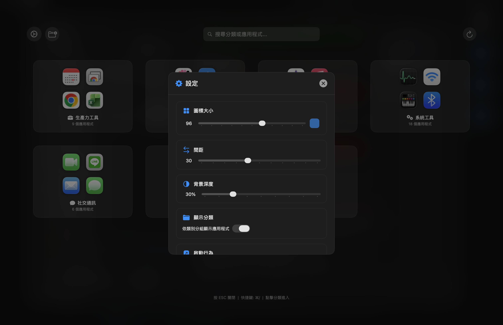

# FullScreenLauncher

一個為 macOS 打造的全螢幕應用程式啟動器，提供類似手機的資料夾式分類體驗。


[](https://github.com/aurocoredev/FullScreenLauncher/releases/tag/v1.2.0)

## 功能特色

- **資料夾式瀏覽** - 點擊分類資料夾進入內頁，手機般的直覺體驗
- **全螢幕顯示** - 覆蓋整個螢幕，沉浸式體驗
- **毛玻璃背景** - 精美的視覺效果
- **自動分類** - 應用程式自動分為：生產力工具、開發工具、影音媒體、社交通訊、系統工具、遊戲、其他
- **自訂分類** - 新增、編輯、刪除分類，自由指派 App
- **即時搜尋** - 首頁搜尋所有 App，資料夾內搜尋該分類
- **自訂設定** - 可調整圖標大小、間距、背景透明度
- **啟動行為** - 可選擇啟動 App 後關閉或保持開啟
- **全域快捷鍵** - 預設 `⌘⌥F1`，可自訂修改
- **狀態列圖標** - 方便快速存取

## 截圖

### 首頁 - 資料夾卡片


### 資料夾內頁 - App 列表


### 分類管理


### 設定面板


## 系統需求

- macOS 12.0 (Monterey) 或更高版本
- Apple Silicon (M1/M2/M3) 或 Intel 處理器

## 安裝方式

### 方法一：下載預編譯版本（推薦）

1. **[點此下載 FullScreenLauncher.app.zip](https://github.com/aurocoredev/FullScreenLauncher/releases/download/v1.2.0/FullScreenLauncher.app.zip)**
2. 解壓縮 zip 檔案
3. 將 `FullScreenLauncher.app` 拖曳到「應用程式」資料夾
4. 首次開啟時，右鍵點擊 → 選擇「打開」（因為沒有 Apple 開發者簽名）

> 或前往 [Releases 頁面](https://github.com/aurocoredev/FullScreenLauncher/releases) 查看所有版本

### 方法二：從原始碼編譯

```bash
# 複製專案
git clone https://github.com/aurocoredev/FullScreenLauncher.git
cd FullScreenLauncher

# 使用 build script 編譯
./build.sh

# 或手動編譯
swiftc -o FullScreenLauncher main.swift -framework Cocoa -framework SwiftUI -framework Carbon -O
```

## 使用方式

| 操作 | 功能 |
|------|------|
| `⌘⌥F1` | 全域快捷鍵開啟/關閉（可自訂） |
| 點擊資料夾 | 進入該分類查看 App |
| `ESC` | 返回上一層 / 清空搜尋 / 關閉視窗 |
| 點擊 ⚙️ | 開啟設定面板 |
| 點擊 📁 | 開啟分類管理 |
| 直接輸入 | 搜尋應用程式 |

### ESC 鍵行為

- 在資料夾內且有搜尋文字 → 清空搜尋
- 在資料夾內且無搜尋文字 → 返回首頁
- 在首頁且有搜尋文字 → 清空搜尋
- 在首頁且無搜尋文字 → 關閉視窗

## 設定選項

在設定面板中可調整：

- **圖標大小** - 48px ~ 128px
- **間距** - 10px ~ 60px
- **背景深度** - 10% ~ 90%
- **顯示分類** - 開啟資料夾模式 / 關閉顯示所有 App
- **啟動行為** - 啟動後關閉 / 保持開啟
- **全域快捷鍵** - 自訂您喜歡的快捷鍵組合

## 更新日誌

### v1.2.0
- 新增資料夾式瀏覽體驗
- 點擊分類卡片進入內頁查看 App
- 資料夾內獨立搜尋功能
- 新增啟動行為設定（關閉/保持開啟）
- ESC 鍵支援多層級返回
- 移除每行數量設定，改為自動計算

### v1.1.0
- 新增自訂分類功能
- 新增分類管理介面
- Bug 修復與效能優化

### v1.0.0
- 首次發布

## 開機自動啟動

1. 開啟「系統設定」→「一般」→「登入項目」
2. 點擊「+」按鈕
3. 選擇「FullScreenLauncher.app」

## 授權條款

本專案採用 MIT 授權條款，詳見 [LICENSE](LICENSE) 文件。

## 貢獻

歡迎提交 Issue 或 Pull Request！

## 致謝

靈感來自 macOS 的 Launchpad，獻給所有懷念全螢幕啟動器的使用者。
