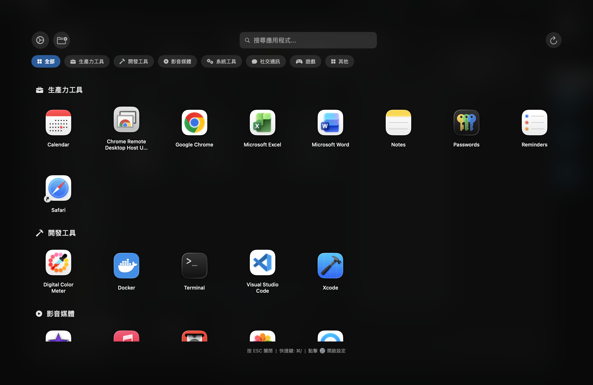
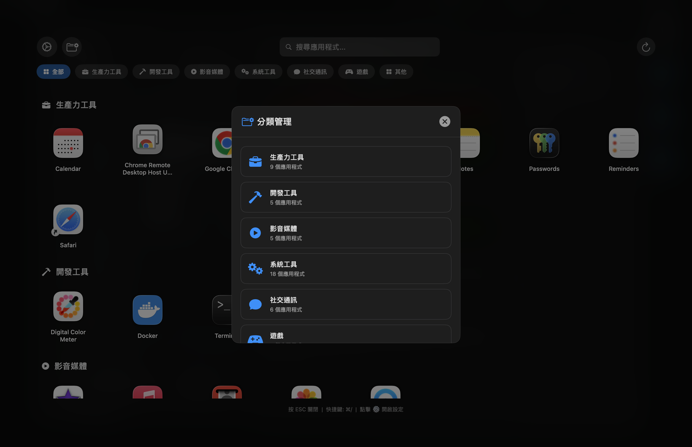

# FullScreenLauncher

一個為 macOS 打造的全螢幕應用程式啟動器，提供類似舊版 Launchpad 的全螢幕體驗。


## 功能特色

- **全螢幕顯示** - 覆蓋整個螢幕，沉浸式體驗
- **毛玻璃背景** - 精美的視覺效果
- **自動分類** - 應用程式自動分為：生產力工具、開發工具、影音媒體、社交通訊、系統工具、遊戲、其他
- **即時搜尋** - 快速找到您要的應用程式
- **自訂設定** - 可調整圖標大小、間距、每行數量、背景透明度
- **全域快捷鍵** - 預設 `⌘⌥F1`，可自訂修改
- **狀態列圖標** - 方便快速存取

## 截圖

### 主畫面


### 分類管理


### 設定面板


## 系統需求

- macOS 12.0 (Monterey) 或更高版本
- Apple Silicon (M1/M2/M3) 或 Intel 處理器

## 安裝方式

### 方法一：下載預編譯版本

1. 前往 [Releases](../../releases) 頁面
2. 下載最新版本的 `FullScreenLauncher.app.zip`
3. 解壓縮後拖曳到「應用程式」資料夾

### 方法二：從原始碼編譯

```bash
# 複製專案
git clone https://github.com/aurocoredev/FullScreenLauncher.git
cd FullScreenLauncher

# 編譯
swiftc -o FullScreenLauncher main.swift -framework Cocoa -framework SwiftUI -framework Carbon

# 建立 .app 包
mkdir -p FullScreenLauncher.app/Contents/MacOS
mkdir -p FullScreenLauncher.app/Contents/Resources
mv FullScreenLauncher FullScreenLauncher.app/Contents/MacOS/
cp Info.plist FullScreenLauncher.app/Contents/
cp AppIcon.icns FullScreenLauncher.app/Contents/Resources/  # 如果有圖標

# 複製到應用程式資料夾
cp -r FullScreenLauncher.app ~/Applications/
```

## 使用方式

| 操作 | 功能 |
|------|------|
| `⌘⌥F1` | 全域快捷鍵開啟/關閉（可自訂） |
| `ESC` | 關閉視窗 |
| 點擊 ⚙️ | 開啟設定面板 |
| 點擊分類標籤 | 過濾應用程式 |
| 直接輸入 | 搜尋應用程式 |

## 設定選項

在設定面板中可調整：

- **圖標大小** - 48px ~ 128px
- **間距** - 10px ~ 60px
- **每行數量** - 自動 或 固定 4~12 個
- **背景透明度** - 10% ~ 90%
- **顯示分類** - 開啟/關閉分類標題
- **全域快捷鍵** - 自訂您喜歡的快捷鍵組合

## 開機自動啟動

1. 開啟「系統設定」→「一般」→「登入項目」
2. 點擊「+」按鈕
3. 選擇「FullScreenLauncher.app」

## 授權條款

本專案採用 MIT 授權條款，詳見 [LICENSE](LICENSE) 文件。

## 貢獻

歡迎提交 Issue 或 Pull Request！

## 致謝

靈感來自 macOS 的 Launchpad，獻給所有懷念全螢幕啟動器的使用者。
