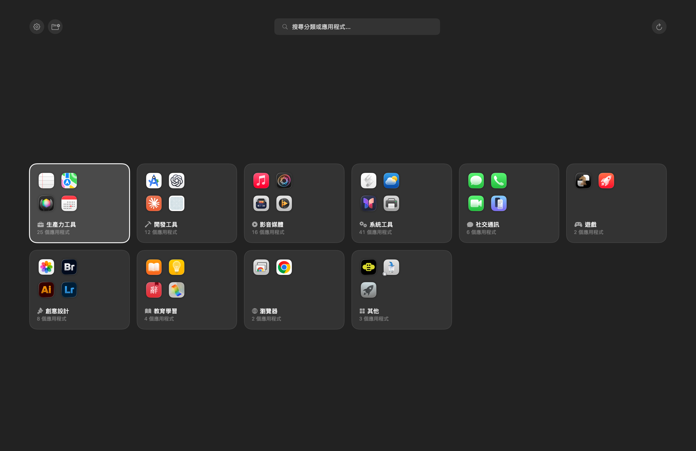
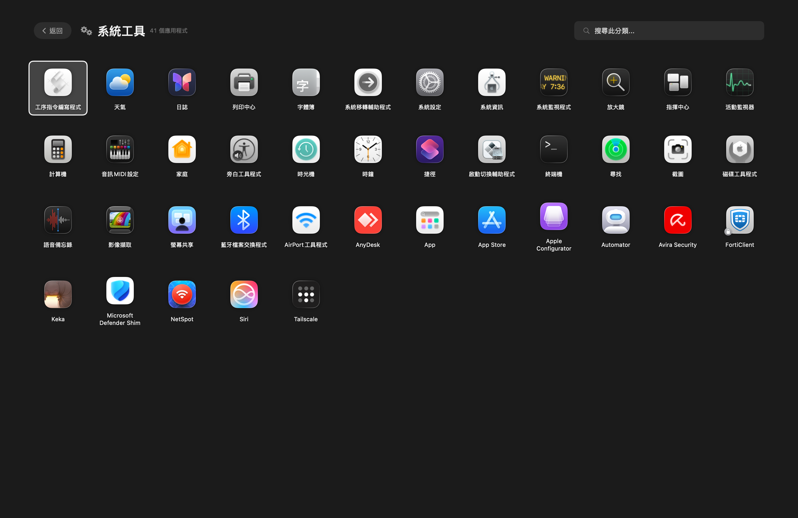
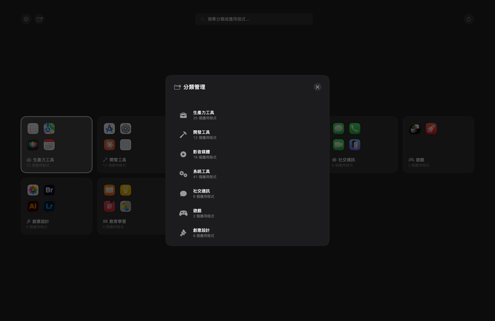
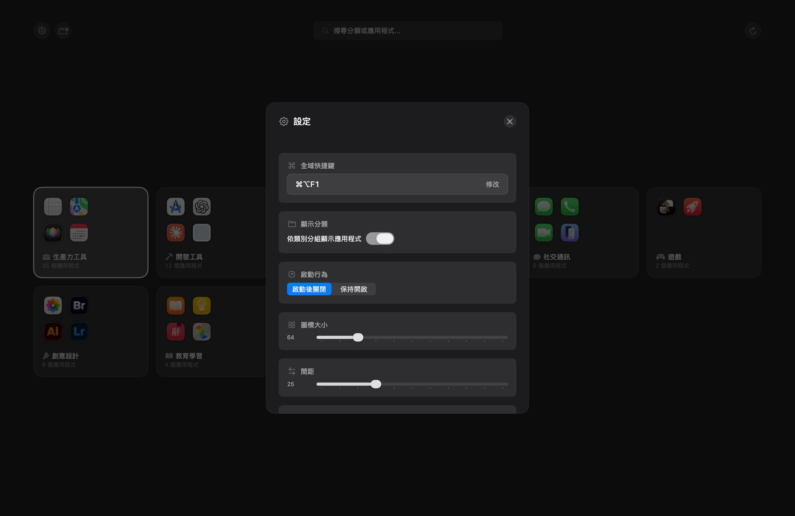

# FullScreenLauncher

一個為 macOS 打造的全螢幕應用程式啟動器，提供類似手機的資料夾式分類體驗。

A full-screen app launcher for macOS with folder-style categorization, just like your phone.


[](https://github.com/aurocoredev/FullScreenLauncher/releases/tag/v1.3.0)

---

**[中文](#中文) | [English](#english)**

---

# 中文

## 功能特色

- **自動分類** - 依 macOS 原生類別與關鍵字，自動分成生產力工具、開發工具、影音媒體、社交通訊、系統工具、遊戲、創意設計、教育學習、瀏覽器、其他
- **資料夾式瀏覽** - 點擊分類資料夾進入內頁，手機般的直覺體驗
- **鍵盤操作** - 方向鍵選擇、`⏎` 開啟、`ESC` 逐層返回
- **即時搜尋** - 首頁搜尋所有 App 並標示所屬分類，資料夾內可再搜該分類
- **在地化名稱** - 系統 App 顯示為系統語言的名稱（「計算機」而非 Calculator），中英文都搜得到
- **自訂分類** - 新增、編輯、刪除分類，自由指派 App
- **全螢幕顯示** - 毛玻璃背景，沉浸式體驗
- **自訂設定** - 可調整圖標大小、間距、背景深度
- **啟動行為** - 可選擇啟動 App 後關閉或保持開啟
- **全域快捷鍵** - 預設 `⌘⌥F1`，可自訂修改；會擋掉系統已佔用的組合
- **狀態列圖標** - 方便快速存取
- **多語言支援** - 支援繁體中文與英文介面切換

## 截圖

### 首頁 - 資料夾卡片


### 資料夾內頁 - App 列表


### 分類管理


### 設定面板


## 系統需求

- macOS 12.0 (Monterey) 或更高版本
- Universal binary，Apple Silicon 與 Intel 皆可執行

## 安裝方式

### 方法一：下載預編譯版本（推薦）

1. **[點此下載 FullScreenLauncher.app.zip](https://github.com/aurocoredev/FullScreenLauncher/releases/download/v1.3.0/FullScreenLauncher.app.zip)**
2. 解壓縮 zip 檔案
3. 將 `FullScreenLauncher.app` 拖曳到「應用程式」資料夾
4. 首次開啟時，右鍵點擊 → 選擇「打開」（因為沒有 Apple 開發者簽名）

> 或前往 [Releases 頁面](https://github.com/aurocoredev/FullScreenLauncher/releases) 查看所有版本

### 方法二：從原始碼編譯

```bash
# 複製專案
git clone https://github.com/aurocoredev/FullScreenLauncher.git
cd FullScreenLauncher

# 使用 build script 編譯
./build.sh

# 或手動編譯（-target 一定要給，否則只能在編譯當下的系統版本執行）
swiftc -o FullScreenLauncher main.swift -framework Cocoa -framework SwiftUI -framework Carbon \
    -target arm64-apple-macos12.0 -O
```

## 使用方式

| 操作 | 功能 |
|------|------|
| `⌘⌥F1` | 全域快捷鍵開啟/關閉（可自訂） |
| 點擊資料夾 | 進入該分類查看 App |
| `↑` `↓` `←` `→` | 選擇分類或應用程式 |
| `⏎` | 開啟選取的項目 |
| `ESC` | 返回上一層 / 清空搜尋 / 關閉視窗 |
| 點擊 ⚙️ | 開啟設定面板 |
| 點擊 📁 | 開啟分類管理 |
| 直接輸入 | 搜尋應用程式 |

### ESC 鍵行為

由最上層往下處理：

1. 有開著的對話框 → 先關閉對話框
2. 正在錄製快捷鍵 → 取消錄製
3. 設定或分類管理面板開著 → 關閉面板
4. 在資料夾內且有搜尋文字 → 清空搜尋
5. 在資料夾內且無搜尋文字 → 返回首頁
6. 在首頁且有搜尋文字 → 清空搜尋
7. 其餘情況 → 關閉視窗，並把焦點交還原本的 App

## 設定選項

在設定面板中可調整：

- **圖標大小** - 48px ~ 128px
- **間距** - 10px ~ 60px
- **背景深度** - 10% ~ 90%
- **顯示分類** - 開啟資料夾模式 / 關閉顯示所有 App
- **啟動行為** - 啟動後關閉 / 保持開啟
- **全域快捷鍵** - 自訂您喜歡的快捷鍵組合
- **語言** - 繁體中文 / English

## 開機自動啟動

1. 開啟「系統設定」→「一般」→「登入項目」
2. 點擊「+」按鈕
3. 選擇「FullScreenLauncher.app」

---

# English

## Features

- **Auto Categorization** - Sorted by the app's native macOS category and keywords into Productivity, Development, Media, Social, Utilities, Games, Design, Education, Browsers and Other
- **Folder-style Browsing** - Click category folders to enter, intuitive like a phone
- **Keyboard Driven** - Arrow keys to select, `⏎` to open, `ESC` to step back
- **Instant Search** - Search every app from home with its category shown, or search inside one folder
- **Localized Names** - System apps show their name in your system language, and match in either language
- **Custom Categories** - Add, edit, delete categories, freely assign apps
- **Full-screen Display** - Frosted glass background, immersive experience
- **Customizable Settings** - Adjust icon size, spacing, background depth
- **Launch Behavior** - Choose to close or stay open after launching an app
- **Global Hotkey** - Default `⌘⌥F1`, customizable; combinations the system already owns are rejected
- **Menu Bar Icon** - Quick access from the status bar
- **Multi-language Support** - Switch between Traditional Chinese and English

## Screenshots

### Home - Folder Cards


### Folder View - App List


### Category Manager


### Settings Panel


## System Requirements

- macOS 12.0 (Monterey) or later
- Universal binary, runs on both Apple Silicon and Intel

## Installation

### Option 1: Download Pre-built Version (Recommended)

1. **[Click here to download FullScreenLauncher.app.zip](https://github.com/aurocoredev/FullScreenLauncher/releases/download/v1.3.0/FullScreenLauncher.app.zip)**
2. Unzip the file
3. Drag `FullScreenLauncher.app` to your Applications folder
4. On first launch, right-click → select "Open" (required for unsigned apps)

> Or visit the [Releases page](https://github.com/aurocoredev/FullScreenLauncher/releases) for all versions

### Option 2: Build from Source

```bash
# Clone the project
git clone https://github.com/aurocoredev/FullScreenLauncher.git
cd FullScreenLauncher

# Build with the build script
./build.sh

# Or compile manually (always pass -target, otherwise the binary only runs on the OS you built it on)
swiftc -o FullScreenLauncher main.swift -framework Cocoa -framework SwiftUI -framework Carbon \
    -target arm64-apple-macos12.0 -O
```

## Usage

| Action | Function |
|--------|----------|
| `⌘⌥F1` | Global hotkey to open/close (customizable) |
| Click folder | Enter category to view apps |
| `↑` `↓` `←` `→` | Move the selection |
| `⏎` | Open the selected item |
| `ESC` | Go back / Clear search / Close window |
| Click ⚙️ | Open settings panel |
| Click 📁 | Open category manager |
| Start typing | Search applications |

### ESC Key Behavior

Handled from the topmost layer down:

1. A dialog is open → close the dialog
2. Recording a hotkey → cancel recording
3. Settings or category manager is open → close the panel
4. In a folder with search text → clear the search
5. In a folder without search text → return home
6. At home with search text → clear the search
7. Otherwise → close the window and hand focus back to the app you were using

## Settings

Available options in the settings panel:

- **Icon Size** - 48px ~ 128px
- **Spacing** - 10px ~ 60px
- **Background Depth** - 10% ~ 90%
- **Show Categories** - Enable folder mode / Disable to show all apps
- **Launch Behavior** - Close after launch / Stay open
- **Global Hotkey** - Customize your preferred key combination
- **Language** - 繁體中文 / English

## Launch at Login

1. Open "System Settings" → "General" → "Login Items"
2. Click the "+" button
3. Select "FullScreenLauncher.app"

---

## Changelog

### v1.3.0
- 自動分類新增創意設計、教育學習、瀏覽器，並改用 macOS 原生類別判斷
- 鍵盤操作：方向鍵選擇、`⏎` 開啟
- 系統 App 顯示在地化名稱，中英文都可搜尋
- 搜尋結果標示所屬分類
- 刪除分類、重置分類加入確認；刪除的預設分類不再自動復原
- 快捷鍵改為交易式更新：註冊失敗保留原設定，並擋掉系統已佔用或無修飾鍵的組合
- 介面改為中性灰階，讓顏色留給 App 圖示；首頁垂直置中、統一格線與 hover
- 空狀態、工具提示、搜尋清除鈕、恢復預設設定
- 修正：建置產物實際只支援 macOS 26 且僅 arm64，現在是 macOS 12+ 的 universal binary
- 修正：ESC 會先關閉最上層的面板或 sheet
- 修正：分類管理不再對每個分類重複掃描一次應用程式

### v1.2.1
- Added Chinese/English language switching
- Multi-language support for UI

### v1.2.0
- New folder-style browsing experience
- Click category cards to enter and view apps
- Independent search within folders
- Added launch behavior setting (close/stay open)
- ESC key supports multi-level navigation
- Removed items-per-row setting, now auto-calculated

### v1.1.0
- Added custom category feature
- Added category management interface
- Bug fixes and performance improvements

### v1.0.0
- Initial release

## License

This project is licensed under the MIT License - see the [LICENSE](LICENSE) file for details.

## Contributing

Issues and Pull Requests are welcome!

## Acknowledgments

Inspired by macOS Launchpad, dedicated to all users who miss a full-screen launcher experience.
